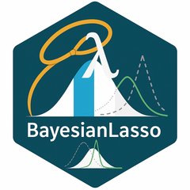

<!-- README.md is generated from README.Rmd. Please edit that file -->

```{r, include = FALSE}
knitr::opts_chunk$set(
  collapse = TRUE,
  comment = "#>",
  fig.path = "man/figures/README-",
  out.width = "100%"
)
```

# BayesianLasso 

<!-- badges: start -->
<!-- badges: end -->

BayesianLasso is an R package for efficient Bayesian inference in sparse linear regression models using the Bayesian Lasso. It includes optimized Gibbs sampling algorithms and utilities for working with the Lasso distribution.

## Installation

You can install the development version of BayesianLasso from [GitHub](https://github.com/) with:

``` r
# install.packages("pak")
pak::pak("garthtarr/BayesianLasso")
```

## Features
* Efficient Gibbs samplers for Bayesian Lasso (e.g., Modified_Hans_Gibbs, Modified_PC_Gibbs)

* Support for drawing from the Lasso distribution

* Utilities for computing moments and densities

## Example Usage

These are basic examples which show you how to solve a common problem:

```{r example}
library(BayesianLasso)
## basic example code

# Simulated data
set.seed(123)
X <- matrix(rnorm(100), 20, 5)
y <- rnorm(20)
beta_init <- rep(1, 5)

# Run modified Hans Gibbs sampler
result <- Modified_Hans_Gibbs(
  X = X,
  y = y,
  a1 = 0.01,
  b1 = 0.01,
  u1 = 0.01,
  v1 = 0.01,
  nsamples = 100,
  beta_init = beta_init,
  lambda_init = 0.1,
  sigma2_init = 1,
  verbose = 0
)

str(result)

```
The `Modified_Hans_Gibbs()` function returns a list with the following components:

- `mBeta`: MCMC samples of the regression coefficients \(\boldsymbol{\beta}\), stored as a matrix with `nsamples` rows and `p` columns.
- `vsigma2`: MCMC samples of the error variance \(\sigma^2\).
- `vlambda2`: MCMC samples of the global shrinkage parameter \(\lambda^2\).
- `mA`, `mB`, `mC`: Matrices containing the MCMC samples of the Lasso distribution parameters \(A_j\), \(B_j\), and \(C_j\) for each coefficient \(\beta_j\), where each row corresponds to one MCMC iteration and each column to a regression coefficient.


## Lasso Distribution Functions
The package provides functions for working with the Lasso distribution:

 * zlasso(): Normalizing constant

 * dlasso(): Density function

 * plasso(): CDF

 * qlasso(): Quantile function

 * rlasso(): Random generation

 * elasso(): Expected value

 * vlasso(): Variance

 * mlasso(): Mode

 * MillsRatio(): Mills ratio

## Citation
If you use this package in your work, please cite it appropriately. Citation information can be found using:

```{r}
citation("BayesianLasso")
```

